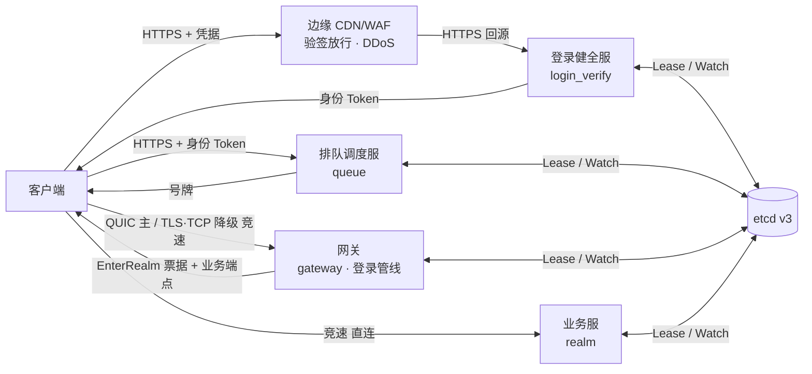
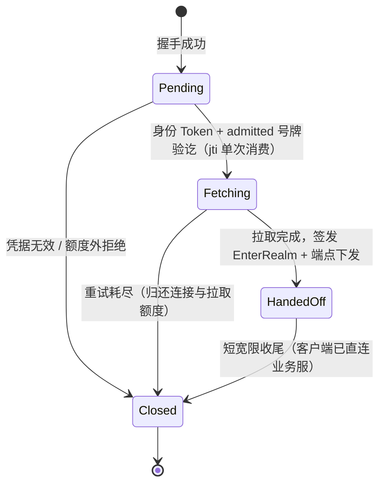

# RealmMesh

RealmMesh 是一个 C++20 分布式游戏服务端框架，目标场景是**瞬时登录洪峰**：百万级
客户端在分钟级窗口内同时发起登录，系统按准入额度有序放行，不雪崩、不丢位次。

接入链路按「健全 → 排队 → 网关管线 → 直连业务服」分层：



- **登录健全服 `login_verify`**：无状态、可水平扩展，只回答账号是否有效（有效/封禁/
  白名单），签发身份 Token（JWT/EdDSA）并暴露 JWKS。
- **排队调度服 `queue`**：发号、查号，按准入额度分批放行；唯一权威状态是已放行号与
  放行速率。
- **网关 `gateway`**：只承载登录管线。Edge Session 三阶段
  `pending → fetching → handed-off`；拉取账号数据完成后下发 EnterRealm 票据与业务服
  端点，不中转业务流量。
- **业务服 `realm`**：选角与游戏业务，EnterRealm 票据兑换点，长连接的落点。
- **边缘 CDN/WAF**：只定契约（验签放行、DDoS 防护），不在本仓库实现；边缘验签是
  能力分级优化，健全服/排队服/网关的本地验签不可省略。
- 业务消息为 4 字节大端长度 + Protobuf `Envelope`（上限 64KiB）；不支持裸 TCP/UDP、
  KCP、自研传输加密或逐消息协议回退。

设计与术语：[架构规格](docs/specs/2026-09-12-login-chain-surge.md)、
[ADR-0004](docs/adr/0004-identity-token-jwt-eddsa.md)、
[ADR-0005](docs/adr/0005-gateway-login-pipeline-direct-connect.md)、
[ADR-0006](docs/adr/0006-stateless-queue-number.md)、
[ADR-0007](docs/adr/0007-self-built-minimal-http1-stack.md)、
[CONTEXT.md](CONTEXT.md)、[架构文档](docs/architecture.md)、
[协议文档](docs/protocol.md)、[分布式日志架构](docs/logging-architecture.md)、
[observability development stack](deploy/observability/README.md)。

## 实施状态

规格本身仍是评审稿；下表"已实现"指代码、配置与测试均已落地。

| 范围 | 状态 |
|---|---|
| 传输基座：QUIC + TLS 1.3、客户端竞速与降级分类 | 已实现 |
| 凭据编解码：极小 JSON（#37）、EdDSA JWT 与 JWKS（#38） | 已实现 |
| HTTPS 服务边：有界 HTTP/1.1 解析与 TLS 传输（#39） | 已实现 |
| 集群：etcd v3 注册/发现、实例额度上报（`conn_free`/`fetch_free`） | 已实现 |
| AccountStore 抽象与配置账号表（#40） | 已实现 |
| 登录健全服 `login_verify`（#41） | 已实现 |
| 排队调度服 `queue`（#42） | 已实现 |
| 网关三阶段管线与实例额度聚合（#43） | 已实现 |
| 限流拉取管线（#44） | 已实现 |
| handoff 与 EnterRealm 签发（#45） | 已实现 |
| 业务服 EnterRealm 兑换与直连入场（#46） | 已实现 |
| 指标/告警/仪表盘（#47）、L1 定向压测与 `realm_mesh_loadgen`（#48） | 已实现 |
| 客户端状态机与自适应轮询（#49） | 已实现 |
| 退役旧 Login 链路（#50） | 已实现 |
| 身份 Token 回放守卫收敛（#63）、客户端真实兑换口（#64） | 已实现 |

旧 `Login → Realm 选角 → Gateway 入场` 链路已整体退役：`login` 服务身份、7000 端口与
旧入场消息编号都已删除，线名 `login` 永不复用（见[架构文档](docs/architecture.md)）。
启用新链路不需要任何开关，仓库里就只有这一条链路。

## 传输与安全

QUIC 与 TLS/TCP 使用相同证书、SNI 和 ALPN `realmmesh-edge/1`。两条路径都只接受
TLS 1.3；首版关闭 0-RTT、会话恢复、QUIC Datagram 与 keepalive。QUIC 每条连接只允许
一个客户端发起的长期双向流，允许连接地址迁移。

HTTP 服务边（健全服、排队服）复用同一证书与 reactor，ALPN 为 `http/1.1`，走自研的
有界 HTTP/1.1 编解码与最小服务端（[ADR-0007](docs/adr/0007-self-built-minimal-http1-stack.md)），
不引入第三方服务端库。

客户端建连策略由 `PreferredTransportConnector` 表达：QUIC 在 0ms 开始，TLS/TCP 在
350ms 后参与竞速，单次握手上限 3 秒、整轮上限 5 秒，第一个安全握手成功者胜出。
只有 `Unsupported`、`NetworkUnreachable`、`HandshakeTimeout` 可以触发降级；证书、
ALPN、鉴权或协议错误不会。网络不可达结果按当前网络缓存 5 分钟，网络切换时清除。
竞速在连网关与直连业务服两条连接上彼此独立适用。

当前仓库包含可移植的竞速策略与错误分类参考实现，首个客户端集成目标为 Windows；
生产客户端 SDK 不在本阶段范围内。

## 凭据体系

| 凭据 | 格式 | 签发方 | 消费方 | 有效期 | 单次消费 |
|---|---|---|---|---|---|
| 身份 Token | JWT/EdDSA（`iss=realmmesh/login-verify`） | 健全服 | 边缘验签、排队服、网关 | 30 min | 网关入口单次消费 `jti` |
| 排队号牌 | JWT/EdDSA（`iss=realmmesh/queue`，含号值与 `admitted`） | 排队服 | 客户端轮询、网关校验 `admitted` | 放行 + 5 min 宽限 | 否（位次查询复用） |
| EnterRealm 票据 | SessionTicket（对称键，用途字节 `EnterRealm=3`；旧用途字节作废不复用） | 网关 | 业务服 Realm 兑换 | 60 s | 是（重放防护） |

Ed25519 私钥只在健全服（`REALMMESH_IDENTITY_KEY_SEED`，hex 注入），公钥经
`GET /.well-known/jwks.json` 发布，内部消费方配置静态载入；轮换走 `kid` 单调递增 +
24h 重叠窗双键并存。封禁/白名单状态不入 Token（签发时检查 + 网关拉取时二次校验兜底）。

## HTTPS API

JSON over HTTP/1.1，keep-alive 必开：

| 端点 | 服务 | 请求 | 成功响应 |
|---|---|---|---|
| `POST /v1/login/verify` | 健全服 | `{account, credential}` | `200 {identity_token, account_id, expires_in}` |
| `POST /v1/queue/tickets` | 排队服 | Bearer 身份 Token | `202 {queue_number_token, number, estimated_wait_seconds}`；同 `sub` 幂等 |
| `GET /v1/queue/progress` | 排队服 | — | `200 {released_number, admit_rate, server_time}`；可 CDN 缓存，位次/ETA 客户端本地算 |
| `GET /v1/queue/tickets/me` | 排队服 | Bearer 号牌 | `200 {status, position, estimated_wait_seconds, admit_grant?}` |
| `GET /.well-known/jwks.json` | 健全服 | — | JWKS |
| `/healthz` | 两个服务 | — | 健康检查 |

错误模型为 `{code, message, retry_after_seconds?}`（HTTP 状态与 `code` 并存）。`code`
分段：`1xxx` 账号与准入（`1001` 凭据无效、`1002` 封禁、`1003` 白名单外、`1004` 额度外），
`2xxx` 排队与网关鉴权（`2001` 号牌无效/过期、`2002` 未鉴权），`3xxx` 业务服（`3002`
入场票据无效）。这些 code 与 `Envelope.message_id` 是两个独立编号空间，数值相同不代表
同一含义。各服务在独立 metrics 端口暴露 Prometheus 指标（见“运行”）。

## 网关登录管线

`EdgeSessionPipeline` 维护 Edge Session 的登录管线阶段与实例额度会计，与传输层的
`EdgeSessionTable` 并存：后者只活在 I/O 线程记录 pending/established，前者活在业务
帧线程，由 `GatewayEvent` 驱动登记/注销、由凭据提交与拉取完成驱动迁移。



`pending → fetching` 的三重闸是身份 Token → `admitted` 号牌 → `jti` 单次消费，全部
通过才迁移并占用拉取额度；额度探针先于 `jti` 消费，满额拒绝不烧凭据。拉取按全局预算
池限流，指数退避 ≤3 次 × 2s，失败断开并归还连接额度与拉取预算。协议上网关以
`EdgeAttach`（1301/1302）接收凭据、以 `EnterRealmGranted`（1303）下发直连凭证与业务
服端点。

MsQuic 回调、TLS/epoll 事件被适配为统一 `GatewayEvent`，再进入有界入站队列；帧线程
只消费事件并提交有界出站命令。过载时可靠连接会被关闭，不允许无界增长。

## 服务发现与额度

服务发现默认关闭，此时使用 Lua 中的固定下游地址。开启后，服务在运行时监听器就绪后
通过 etcd v3 Lease 发布端点并 Watch 下游；首次注册成功才进入 ready。`required = true`
会将注册失败显式报错，`false` 会记录告警并保持 not-ready，统一启动器不放行未就绪的
服务。

网关与业务服同时按阈值向 etcd 上报实例额度：key 为
`/realmmesh/budgets/service/<gateway|realm>/<instance_id>/budget`，值
`{conn_free, fetch_free?, updated_at}`（`fetch_free` 只在有拉取管线的 `gateway` 上出现，
`realm` 的 `has_fetch = false`），与实例注册挂同一租约（实例死则额度消失）。排队调度服
Watch 该前缀，按 `min(Σ网关 fetch_free/conn_free, Σ业务服 conn_free, 配置步长)` 定时放批
（≥2s 一批）。

## 构建

三平台支持等级见 [ADR-0002](docs/adr/0002-cross-platform-support-policy.md)：Linux
是生产与行为基准（QUIC 只在此构建与测试），macOS 是开发基准（编译、起拓扑、
`ctest` 全绿；`TransportFactory` 按平台能力禁用 QUIC，只走 TLS/TCP），Windows 当前
只交付后端开关（`iocp` 可配置但显式未实现，不进 CI）。同一构建只编入一个平台后端，
后端在配置期选定（[ADR-0001](docs/adr/0001-compile-time-platform-backends.md)）。

共同要求：CMake 3.20+、C++20 编译器与 OpenSSL 3 开发包。第三方依赖（Lua、sol2、
libsodium、nlohmann/json、cpp-httplib、protobuf、spdlog）随源码树一并构建，无需另行
安装。

Ubuntu 24.04（生产基准，含 QUIC）：

```bash
sudo apt install libssl-dev libxdp1 libnl-3-200 libnl-route-3-200 libnuma1
./scripts/install-msquic-dev.sh
./scripts/build.sh
```

macOS（开发基准，仅 TLS/TCP）：

```bash
brew install openssl@3
export OPENSSL_ROOT_DIR="$(brew --prefix openssl@3)"
export PATH="$(brew --prefix openssl@3)/bin:$PATH"   # 测试证书生成要用 openssl(1)
./scripts/build.sh
```

`scripts/build.sh` 依次执行 `cmake --preset dev`、`cmake --build --preset dev` 和
`ctest --preset dev`（配置 + 构建 + 全量测试），并在首次构建时把
`compile_commands.json` 链接到仓库根。

MsQuic 开发安装脚本固定使用 Microsoft 官方 `libmsquic 2.5.10` 包和对应头文件，
下载内容均校验 SHA-256。也可自行安装 MsQuic，并通过 `MSQUIC_ROOT` 指向其前缀。
服务发现需要本地 etcd：`./scripts/install-etcd.sh` 安装固定版本 3.6.14，
`./scripts/run-etcd-dev.sh` 以前台单节点启动。

## 开发证书与密钥

私钥不得提交仓库。下面示例生成仅用于本机的短期证书；生产环境应由受信 CA 签发，
客户端必须进行 DNS 名称和证书链校验。健全服与排队服还需各自的 Ed25519 签名种子
（hex）：

```bash
mkdir -p .local/tls
openssl req -x509 -newkey rsa:2048 -nodes \
  -keyout .local/tls/private-key.pem \
  -out .local/tls/certificate.pem \
  -days 7 -subj /CN=localhost \
  -addext 'subjectAltName=DNS:localhost,IP:127.0.0.1'

export REALMMESH_TLS_CERTIFICATE_FILE="$PWD/.local/tls/certificate.pem"
export REALMMESH_TLS_PRIVATE_KEY_FILE="$PWD/.local/tls/private-key.pem"
export REALMMESH_SESSION_TICKET_KEY="$(openssl rand -hex 32)"   # 网关签发 / Realm 兑换
export REALMMESH_IDENTITY_KEY_SEED="$(openssl rand -hex 32)"   # 健全服签发身份 Token
export REALMMESH_QUEUE_KEY_SEED="$(openssl rand -hex 32)"      # 排队服签发号牌
```

统一入口当前会忽略 `SIGHUP`，证书与私钥只在进程启动时加载。轮换开发或生产凭据后，
需要重启对应进程。

## 运行

开发环境可使用管理脚本一键启动或重启全部服务：

```bash
# all-in-one：单进程承载完整拓扑（四个服务）
./scripts/dev-all-in-one.sh          # 默认 restart
./scripts/dev-all-in-one.sh status
./scripts/dev-all-in-one.sh stop

# 同机多进程开发模式：realm 与 gateway 各占一个进程
./scripts/dev-services.sh          # 默认 restart
./scripts/dev-services.sh status
./scripts/dev-services.sh stop
```

脚本默认使用 `.runtime/tls/` 中的开发证书，将 PID 写入 `.runtime/pids/`。all-in-one
控制台输出追加到 `.runtime/logs/all-in-one/console.log`；多进程模式的 supervisor
日志写入 `.runtime/logs/supervisor/console.log`，各服务输出追加到
`.runtime/logs/<service>/console.log`。首次运行前需要完成构建和开发证书生成。

多进程脚本由后台 supervisor 按 `Realm → Gateway` 启动，每个服务的
`realmmesh_service_ready` 指标变为 `1` 后才启动下一个服务。默认每项最多等待
10 秒，可用 `REALMMESH_STARTUP_TIMEOUT_SECONDS` 调整。任一服务启动失败或运行中
退出时，supervisor 会按 `Gateway → Realm` 回收整组进程。

这里的“多进程”只表示同一开发机上的独立服务进程，仍使用 Lua 中的环回地址，
不代表已经支持跨机器生产部署、服务多副本或高可用。

也可以手动启动。`realm_mesh` 是唯一入口，默认按 `configs/main.config` 的拓扑
all-in-one 启动全部服务：

```bash
./build/dev/bin/realm_mesh --config configs
./build/dev/bin/realm_mesh --config configs --service login_verify   # 单服务模式
```

用法：`realm_mesh [--config <dir>] [--service <name>] [--instance-id <id>]
[--node-id <id>] [--zone <zone>]`。`--config` 默认当前目录下的 `configs/`；
`--service` 取 `login_verify` / `queue` / `realm` / `gateway`，收窄为单服务
进程；`--instance-id` / `--node-id` / `--zone` 覆盖服务发现身份。`SIGINT` / `SIGTERM`
触发优雅停机。

默认监听：

| 服务 | 端口 | 传输 | metrics |
|---|---|---|---|
| `login_verify` | 0（内核分配） | HTTPS/JSON | 9104 |
| `queue` | 0（内核分配） | HTTPS/JSON | 9105 |
| `gateway` | 8000 | QUIC 优先，TLS/TCP 兜底 | 9103 |
| `realm` | 7100 | TLS/TCP | 9102 |

健全服与排队服在开发配置里以 `listen_port = 0` 由内核分配端口（避免端口冲突），
部署时显式指定。Gateway 会把两个候选端点一并下发，候选项包含
`protocol/address/port/priority`；QUIC 与 TLS/TCP 使用相同主机名和数字端口（分别占用
UDP 与 TCP 端口空间）。

## 配置

启动配置位于 `configs/`，按 `common/` + `services/<name>.lua` 分层装载，拓扑由
`main.config` 描述。安全传输示例：

```lua
{
    name = "client_quic",
    protocol = "quic", -- 或 "tls_tcp"
    enabled = true,
    listen_address = "0.0.0.0",
    listen_port = 8000,
    max_sessions = 10000,
    max_payload_size = 65536,
    max_pending_output_bytes = 4194304,
    handshake_timeout_ms = 3000,
    idle_timeout_ms = 30000,
    alpn = "realmmesh-edge/1",
    certificate_chain_file_environment = "REALMMESH_TLS_CERTIFICATE_FILE",
    private_key_file_environment = "REALMMESH_TLS_PRIVATE_KEY_FILE",
}
```

健全服的账号有效性数据源是 `AccountStore`，v1 由 `configs/common/accounts.lua`
装载内存表（含有效/封禁/白名单外样例）；DB/Redis 真源以新实现替换，调用方零改动。
排队服的放行步长（`release_step`）与批次间隔（`release_interval_seconds`）、网关的
拉取并发预算（`pipeline_fetch_capacity`）与重试参数都在各自服务配置中。

## 测试

归置、注册与标签约定见 [tests/README.md](tests/README.md)。标签只有 `unit` 与
`integration` 两类：进程内单测与 Lua 模块测试归 `unit`（快速子集），占用固定端口
或拉起 `realm_mesh` 的用例必须显式标 `integration`。

```bash
ctest --preset dev            # 全量
ctest --preset dev -L unit    # 快速子集：C++ 单测 + Lua 模块测试
ctest --preset dev -L lua     # 只筛 Lua 用例
./scripts/test-watch.sh       # 保存即重跑快速子集（单跑一轮加 --once）
./scripts/build.sh            # 配置 + 构建 + 全量测试
```

单元测试基座是 Google Test 1.17 与 LuaUnit v3.5（均经 FetchContent 固定版本），
分别由 `realm_add_gtest` / `realm_add_lua_test` 注册；`configs/*.lua` 的真实加载路径
在 C++ 侧由 `configs_load_smoke_test` 覆盖，不在 Lua 里测。

集成测试覆盖真实 TLS 1.3/ALPN 往返、真实 MsQuic 往返（仅 Linux）、无 ALPN 不创建
业务连接、QUIC 竞速与安全降级分类、IPv6 双栈、端点序列化、Edge Session 三阶段管线
与凭据校验链（身份 Token 回放守卫、号牌 `admitted` 校验、EnterRealm 票据单次兑换），
以及完整的 Gateway 准入→直连票据→Realm 入场链路；同时覆盖 all-in-one 和同机多进程
启动、就绪门禁、失败整组回收与反序停机，以及已退役消息编号在 Realm 与 Gateway 两侧
被拒。prometheus 规则与 Grafana 仪表盘的指标引用由 `observability_artifacts_test`
守住，改动指标名而不更新规则会失败。

压测工具 `realm_mesh_loadgen`（#48）以真实服务回环驱动机器人，按阶段
（`--phase verify|tickets|poll|gateway|all`）与内置档（`--profile soak|m2`）跑定向
压测，不进入服务拓扑。测试证书和私钥只生成在 `build/` 中。push / PR 时 GitHub
Actions 在 macOS 与 Linux 双平台跑全量 `ctest --preset dev`
（`.github/workflows/ci.yml`），QUIC 路径仅在 Linux 覆盖。

## License

许可证尚未确定；正式添加许可证前默认保留所有权利。
