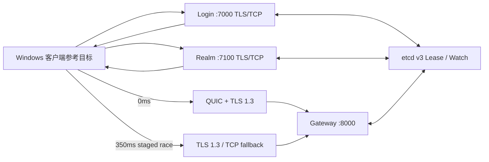
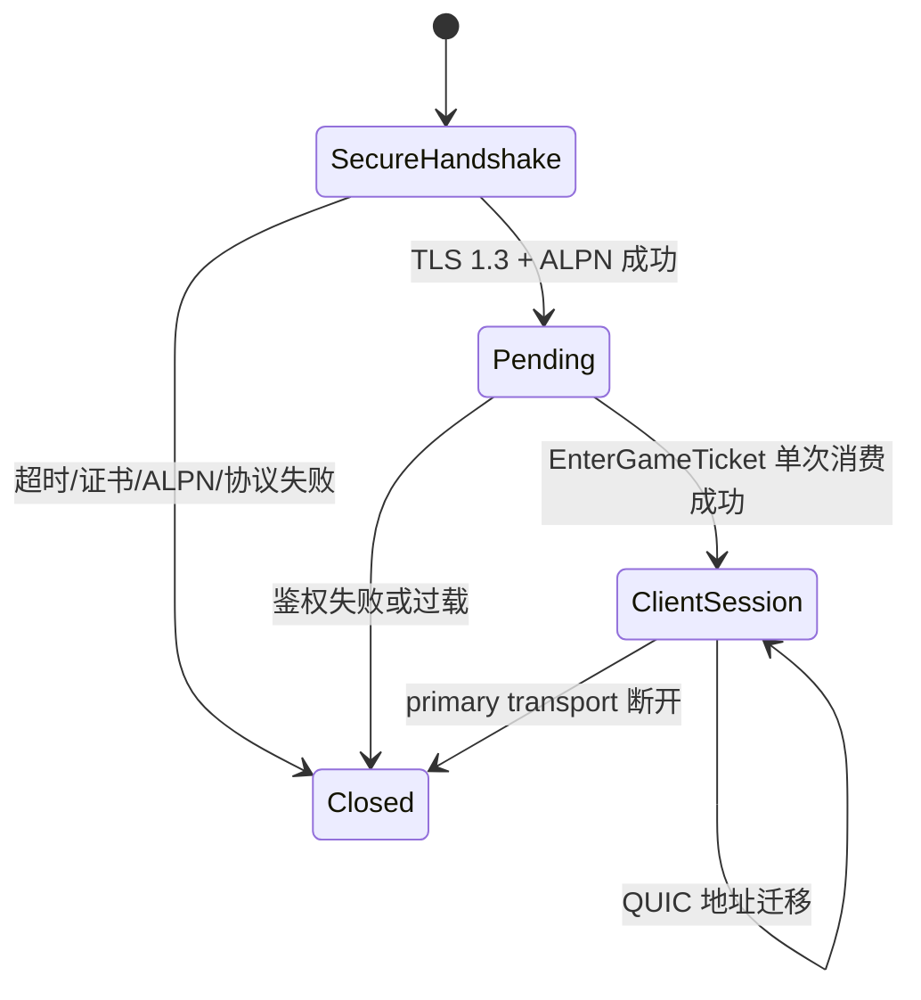
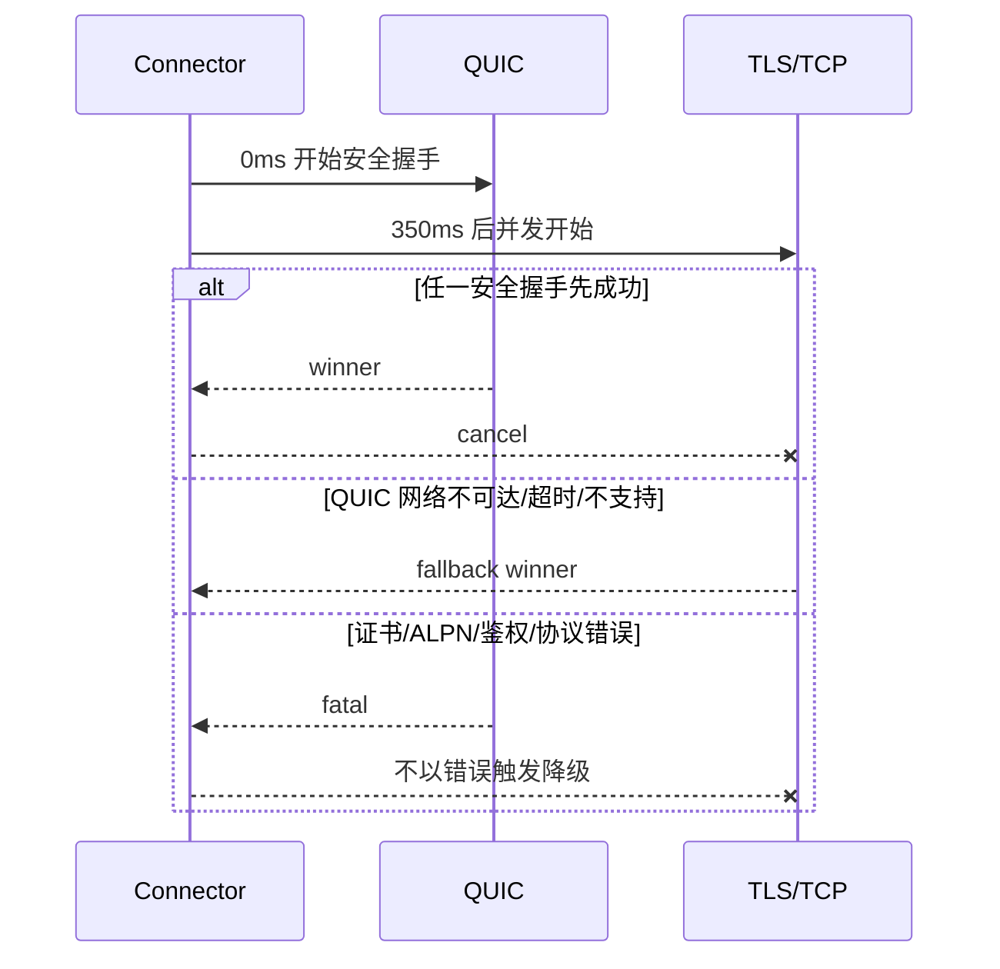
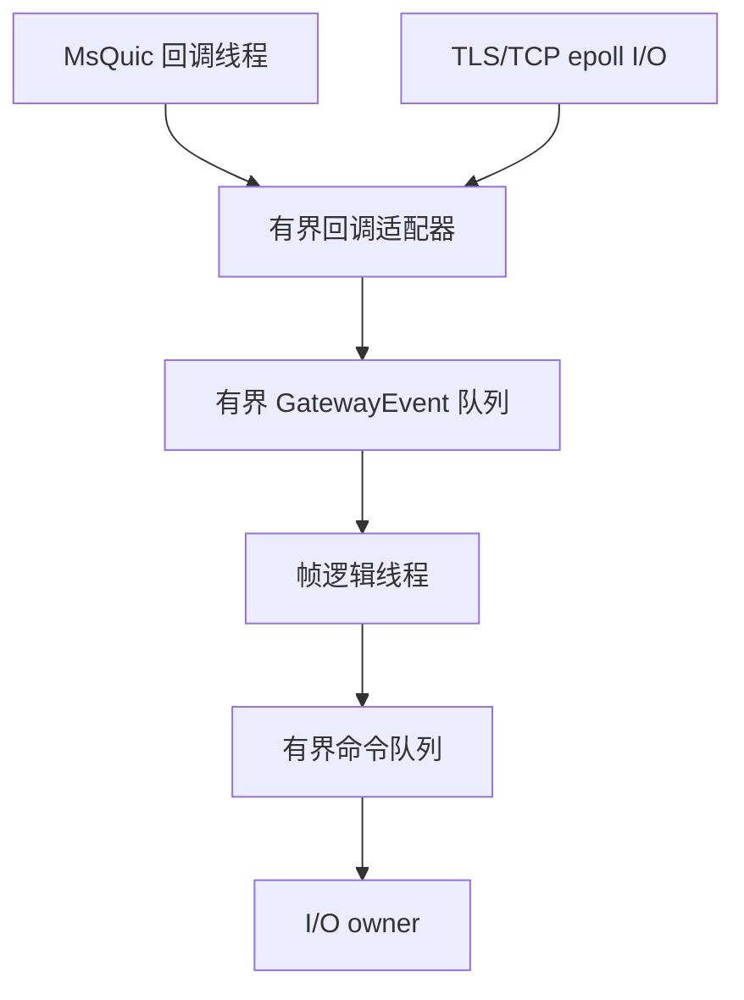

# RealmMesh 接入架构

## 服务拓扑

Login 返回一个 Realm TLS/TCP 候选；Realm 返回 Gateway 的 QUIC 与 TLS/TCP 候选，
两者主机名和数字端口相同，协议和优先级显式编码，不依赖客户端隐式约定。

## Gateway 建连与会话

`ClientSessionRegistry` 只记录一个 primary transport。QUIC 和 TLS/TCP 是初次连接时的
二选一候选，不是一个会话里的双通道。当前没有恢复 token、序列号或重放窗口，因此
已建立连接中断不会透明迁移到另一传输。

## 客户端竞速

握手上限 3 秒，整轮上限 5 秒。仅 QUIC 网络不可达和超时写入 5 分钟负缓存；网络
变化立即清空。0-RTT 关闭，连接竞速期间不发送业务票据。

## 线程边界

MsQuic 自有调度不会直接调用业务逻辑。回调只完成长度帧组装并发布统一事件；队列满
时关闭可靠连接。鉴权成功响应与 pending→ClientSession 晋升由同一个 I/O 命令完成，
避免发送成功但晋升命令入队失败的半状态。

## 安全与资源限制

- TLS 1.3 only，ALPN 固定 `realmmesh-edge/1`，服务端认证，无 mTLS。
- QUIC：一个客户端双向流、零单向流、无 Datagram、无 0-RTT、无恢复、允许迁移。
- `Envelope` 最大 64KiB；每连接有待发送字节高水位。
- 握手 3 秒、空闲 30 秒、keepalive 关闭。
- `SIGHUP` 原子替换新连接所用证书上下文；失败时保留旧上下文。
- libsodium 仅用于业务会话票据，不参与传输加密。

## 分层

- `framework/network`：QUIC、TLS/TCP、长度帧、客户端竞速策略。
- `game/gateway`：pending 连接、ClientSession、运行时队列。
- `game/common`：Envelope 编解码和业务票据。
- `framework/cluster`：多协议端点注册与发现。
- `apps/*`：三段业务入口与信号处理。
