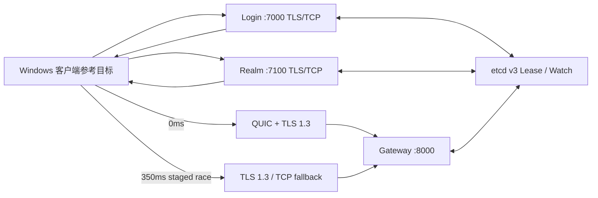
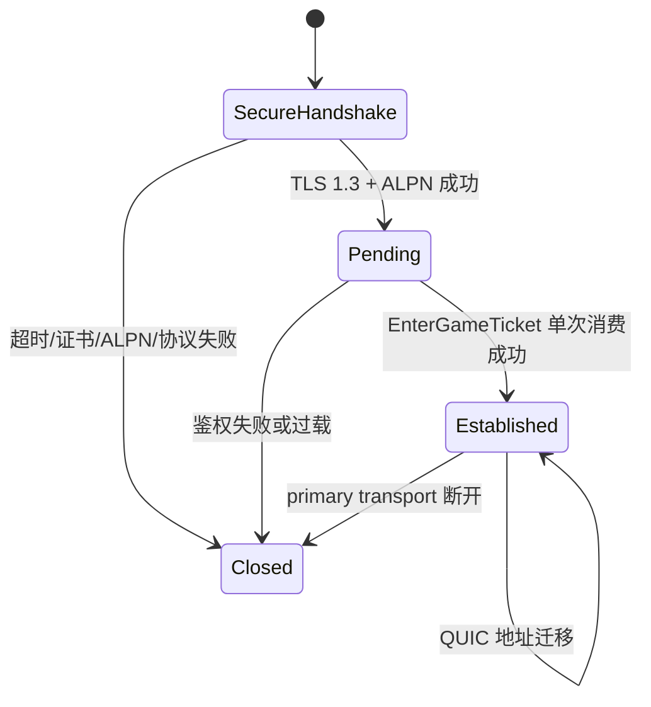
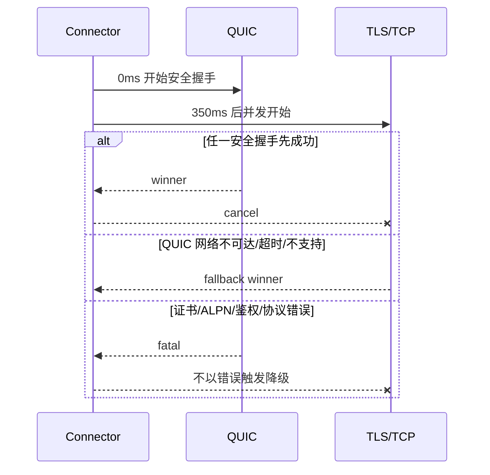
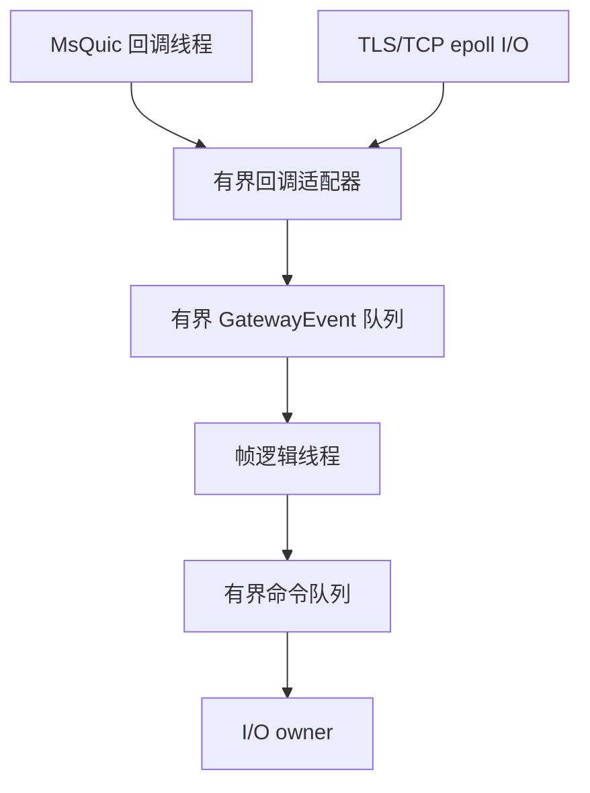

# RealmMesh 接入架构

## 服务拓扑

Login 返回一个 Realm TLS/TCP 候选；Realm 返回 Gateway 的 QUIC 与 TLS/TCP 候选，
两者主机名和数字端口相同，协议和优先级显式编码，不依赖客户端隐式约定。

## Gateway 建连与会话

`EdgeSessionTable` 以单一 id 空间(`EdgeSessionId`)记录每个 Edge Session 的唯一
primary transport 与阶段(pending/established)。QUIC 和 TLS/TCP 是初次连接时的
二选一候选，不是一个会话里的双通道。当前没有恢复 token、序列号或重放窗口，因此
已建立连接中断不会透明迁移到另一传输。

两种用途的 Session Ticket 都只在各自的兑换点单次消费(重放防护):Login 票据在
Realm 兑换，EnterGame 票据在 Gateway 兑换；兑换成功响应与 pending→established
迁移由同一个 I/O 命令完成，重放或无效票据按鉴权失败处理并断开。

## 客户端竞速

握手上限 3 秒，整轮上限 5 秒。仅 QUIC 网络不可达和超时写入 5 分钟负缓存；网络
变化立即清空。0-RTT 关闭，连接竞速期间不发送业务票据。

## 线程边界

MsQuic 自有调度不会直接调用业务逻辑。回调只完成长度帧组装并发布统一事件；队列满
时关闭可靠连接。鉴权成功响应与 pending→established 迁移由同一个 I/O 命令
(`try_accept`)完成，避免发送成功但迁移失败的半状态；decline/close 与 accept
失败等本地终结由 runtime 合成恰好一次 SessionClosed 事件，不依赖传输层上报。

## 安全与资源限制

- TLS 1.3 only，ALPN 固定 `realmmesh-edge/1`，服务端认证，无 mTLS。
- QUIC：一个客户端双向流、零单向流、无 Datagram、无 0-RTT、无恢复、允许迁移。
- `Envelope` 最大 64KiB；每连接有待发送字节高水位。
- 握手 3 秒、空闲 30 秒、keepalive 关闭。
- `SIGHUP` 当前被忽略（前台运行时终端关闭不再终止进程）；证书上下文热替换为规划中的后续能力，未实现前更换证书需重启进程。
- libsodium 仅用于业务会话票据，不参与传输加密。

## 分层

- `framework/network`：QUIC、TLS/TCP、长度帧、客户端竞速策略。
- `game/gateway`：Edge Session 表(pending/established)、运行时队列与 I/O 线程。
- `game/common`：Envelope 编解码、业务票据与账号数据源抽象（AccountStore）。
- `framework/cluster`：多协议端点注册与发现。
- `framework/service_host`：把服务名、分层配置与集群接线装配成一个可运行服务。
- `apps/mesh_host`：`realm_mesh` 单一入口，以 `--service` 区分三段服务与信号处理。

## 未实现的服务与模块

目录树只反映已实现代码:规划中的服务与模块不预先创建空目录,意图记录在本节(理由见
[ADR-0003](adr/0003-lean-tree-no-speculative-placeholders.md))。新增服务时按需创建
`game/<service>/`、`apps/<service>/` 与对应 `CMakeLists.txt`。

服务身份的权威列表在 `realm::cluster::ServiceType`
(`framework/cluster/include/realmmesh/cluster/service_registry.hpp`),线名映射在
`service_type_name` / `parse_service_type`。枚举只包含已接线的 3 个身份:

| ServiceType | 线名 | 状态 |
|---|---|---|
| `Gateway` | `gateway` | 已接线,Gateway 入口,端口 8000,QUIC 优先 |
| `Login` | `login` | 已接线,端口 7000 |
| `Realm` | `realm` | 已接线,端口 7100 |

`login` 与 `realm` 没有独立的业务库:三者在 `framework/service_host` 中共用
`game::gateway::GatewayRuntime`,差异只在传输配置与 `ServiceFrame` 的事件处理分支。

不预先在枚举里登记未实现的服务身份:新服务进入实现时才添加 `ServiceType` 条目与线名映射
(此前枚举曾预留 6 个未实现身份,已按 ADR-0003 移除)。`realm_mesh --service` 经
`self_service_type` / `known_service` 只接受上表中的身份。

Framework 侧同样按需新建。`base`、`memory`、`rpc`、`serialization`、`storage` 这几个名字
曾被空目录预留,但代码与文档都没有定义它们的职责;需要时从第一个真实用例开始设计,
不预设分层。
