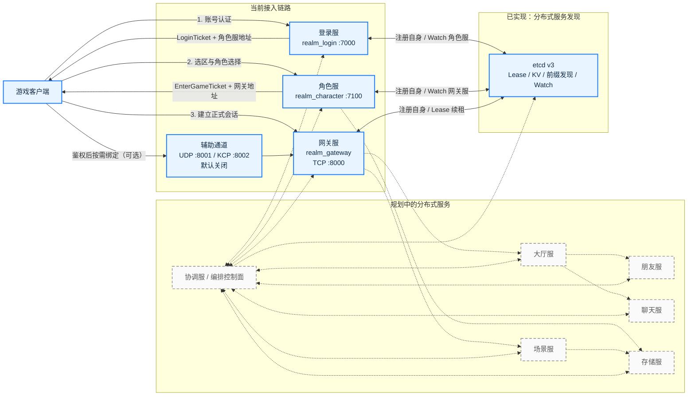
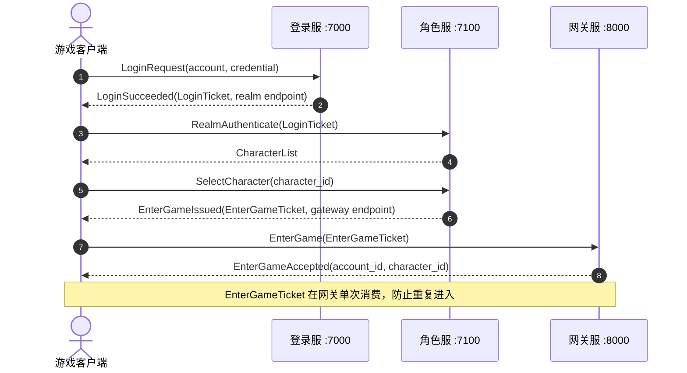
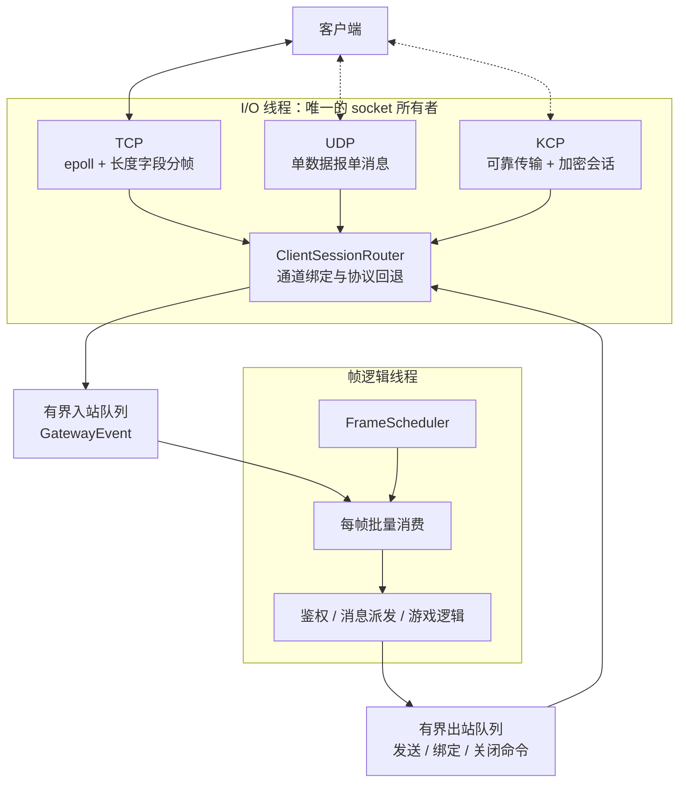
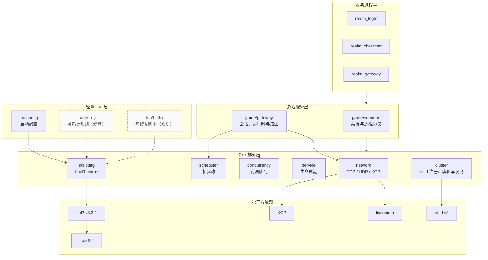

# RealmMesh 架构

本文档描述 RealmMesh 当前已经实现的结构，以及后续分布式服务规划。蓝色节点和
实线连接代表已有代码，灰色虚线节点和连接代表规划项。

## 服务拓扑

客户端依次连接登录服、角色服和网关服。前一个服务只向客户端签发短期票据并返回下一个服务的地址，不代理后续业务流量。

图中“已实现：分布式服务发现”区域及其三条实线就是当前已经落地的服务发现链路。
`EtcdServiceRegistry` 已实现带 Lease 的注册、自动续租、前缀发现和 Watch 缓存，
登录服、角色服与网关服会直接连接 etcd。灰色虚线的协调服仍属于规划中的编排
控制面，不作为基础服务发现的单点代理。

## 三阶段接入时序

三个服务共享会话票据签名密钥，但客户端只能获得带用途和有效期的短期票据。正式公网部署还需要给登录服和角色服入口增加 TLS。

时序中的业务消息全部使用 Protocol Buffers，并由统一 `Envelope` 携带协议版本、
消息 ID 和请求 ID。TCP 的长度字段以及 UDP/KCP 的安全与可靠传输头位于
`Envelope` 外层，协议细节见 [protocol.md](protocol.md)。

## 网关线程与多协议模型

每个客户端对应一个逻辑 `ClientSession`。TCP 是主通道，UDP/KCP 只有在鉴权并绑定后才能加入同一会话；业务发送时可以逐包选择首选协议，通道不可用时按策略回退 TCP 或丢弃。

队列满时不会无限增长：UDP 入站可以丢弃，TCP/KCP 入站过载会断开对应会话，TCP 单连接另有待发送字节高水位限制。

## C++ 与 Lua 分层

C++ 负责网络、并发、帧循环、服务治理和核心状态。Lua VM 由 `LuaRuntime` 持有并绑定到单个逻辑线程；业务脚本应在帧边界检查和切换，新版本加载失败时继续使用上一版本。
