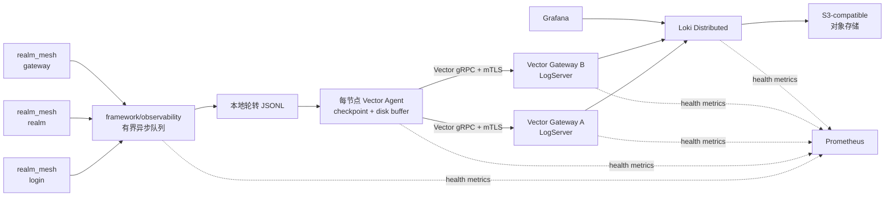

# RealmMesh 分布式日志架构

> 状态：第一阶段基线已实施（2026-08-23）。生产分布式部署、故障注入和容量验收仍待
> 实际运行环境验证。
>
> 范围：第一阶段只建设诊断日志链路。审计日志和玩家行为事件保留独立语义，
> 不与诊断日志共享可靠性、权限或保留策略。

已落地内容包括：spdlog 固定版本依赖、双有界队列 JSONL logger、敏感字段拒绝、字段
分类、运行期级别与采样热更新、Prometheus 指标端点、三服务生命周期日志、I/O 异常
留存、签名票据 v2 `correlation_id` 传播，以及双 Vector Gateway 的 mTLS 参考栈。

尚未宣称完成的是生产验收：10,000 events/s 压测、30 分钟故障恢复、磁盘水位渐进
丢弃、正式仪表盘和告警、secret canary 全链路验证、Loki Distributed、外部对象存储、
SSO/RBAC 和 canary 发布。这些项目需要真实基础设施和容量数据，不能由本地 Compose
替代。

## 目标与约束

RealmMesh 是 20 FPS 帧驱动服务。日志调用不得执行网络 I/O 或磁盘 I/O，也不得在
队列满、日志网关不可达或存储故障时阻塞帧线程。

第一阶段目标：

- 集中收集 Login、Realm、Gateway 的结构化诊断日志。
- 通过稳定的 `correlation_id` 关联 Login -> Realm -> Gateway 登录旅程。
- 日志平台故障时业务继续运行，并通过本地有界缓冲恢复发送。
- 稳态支持 1,000 events/s，支持 10,000 events/s、最长 5 分钟的突发。
- 生产日志可搜索延迟 p95 不超过 15 秒，p99 不超过 30 秒。
- 单个 LogServer 中断 30 分钟时，在磁盘容量充足的前提下不丢失
  `WARN`/`ERROR`。

非目标：

- 不自研日志索引、对象存储、查询 UI 或告警引擎。
- 不提供 exactly-once、跨节点严格全局顺序或无限期缓冲。
- 不把普通诊断日志提升等级后当作审计日志使用。
- 不在第一阶段引入分布式 trace/span；当前三段流程是客户端持票跳转，
  不是服务间 RPC 调用链。

## 总体架构



独立 LogServer 由两个无状态 Vector Gateway 实例承担，而不是新增一个 C++
`realm_log` 进程。它们负责 mTLS 接入、字段校验、限流、规范化和向 Loki 批量转发，
不保存权威状态。

Vector Agent 直接配置多个 Gateway 地址，不通过 RealmMesh 的 etcd resolver。这样可以
避免 etcd 故障导致业务服务和日志链路同时失明，也不需要扩展 `ServiceType::Log`。

## 组件职责

| 组件 | 职责 | 明确不负责 |
|---|---|---|
| `framework/observability` | 结构化日志 API、上下文、采样、有界队列、JSONL 输出、健康指标 | 网络传输、集中存储 |
| Vector Agent | 文件 checkpoint、磁盘缓冲、二次脱敏、批量和重试 | 业务字段生成、查询 |
| Vector Gateway | mTLS、校验、限流、字段规范化、下游确认 | 持久化权威数据、查询 UI |
| Loki Distributed | 日志分块、索引标签、查询 | 用户身份、业务告警决策 |
| S3-compatible 存储 | 日志 chunk 持久化 | 在线查询入口 |
| Grafana | 查询、仪表盘和受控访问 | 日志采集 |
| Prometheus | 日志管道健康指标和告警数据 | 保存诊断日志正文 |

Vector 原生 source/sink 当前提供 acknowledgement、重试和稳定的 Vector-to-Vector
传输语义。第一阶段因此使用 Vector gRPC，而不是 beta 状态的 Vector OTLP 组件。
业务进程只写 JSONL，未来替换 Agent 或 Gateway 时不需要修改业务日志调用。

参考：

- [Vector source](https://vector.dev/docs/reference/configuration/sources/vector/)
- [Vector sink](https://vector.dev/docs/reference/configuration/sinks/vector/)
- [Vector reliability guarantees](https://vector.dev/docs/architecture/guarantees/)

## 应用日志接口

业务代码只依赖 `framework/observability` 提供的 RealmMesh 日志门面：

```cpp
log.info(
    "player_session_established",
    field("account_id", account_id),
    field("request_id", request_id));
```

业务代码不得直接依赖 spdlog、拼接 JSON、连接 LogServer 或感知 Loki 字段映射。

内部实现使用固定版本和哈希的 spdlog：

- 普通队列承载 `TRACE`、`DEBUG`、`INFO`。
- 高优先级队列承载 `WARN`、`ERROR`。
- 两个队列都有固定容量和独立异步执行资源，共享线程安全的 JSONL rotating sink。
- 队列满时使用 `discard_new`，不允许使用默认阻塞策略。
- 正常退出可限时刷新；非信号触发的 `FATAL` 最多等待约 2 秒。
- 崩溃信号处理不调用常规 logger，只允许最小、signal-safe 的 crash 记录路径。

普通队列满时丢弃新事件。高优先级队列拥有预留容量；即使它也已满，帧线程仍不阻塞，
只增加原子丢弃计数。

参考：

- [spdlog asynchronous logging](https://github.com/gabime/spdlog/wiki/Asynchronous-logging)
- [spdlog rotating sinks](https://github.com/gabime/spdlog/wiki/Sinks)

## 本地文件与配置

每个服务进程写入独立文件：

```text
.runtime/logs/<service>/<instance>.jsonl
```

默认轮转策略：

- 单文件上限 128 MiB。
- 保留 8 个文件。
- 单进程最大占用约 1 GiB。
- 开发模式可额外启用人类可读 console sink；Vector 只读取 JSONL。

启动配置位于 `lua/config/services/`：

```lua
logging = {
    level = "info",
    module_levels = {},
    normal_queue_capacity = 8192,
    priority_queue_capacity = 2048,
    file_size_bytes = 134217728,
    retained_files = 8,
    sample_rates = {},
    metrics_listen_address = "127.0.0.1",
    metrics_port = 9101, -- 示例；同一节点上的服务必须使用不同端口
}
```

`SIGHUP` 原子更新默认级别、模块级别和采样率。更新失败时继续使用上一份配置并记录
错误；队列和文件容量等结构性配置只在启动时生效。

故障策略：

| 故障 | 行为 |
|---|---|
| 生产启动时无法创建 JSONL | 启动失败，不在完全失明状态下接收流量 |
| 开发启动时无法创建 JSONL | 退化为 JSON stderr |
| 运行期间文件写入失败 | 业务继续，退化到 JSON stderr，增加指标并告警 |
| Vector/Gateway/Loki 不可用 | 业务照常启动和运行，依赖 Agent 缓冲与重试 |

## 事件 Schema

第一版事件格式：

```json
{
  "schema_version": 1,
  "timestamp": "2026-08-23T12:34:56.123456789Z",
  "severity": "INFO",
  "kind": "diagnostic",
  "event_name": "player_session_established",
  "message": "player session established",
  "environment": "production",
  "cluster": "cn-east",
  "region": "cn",
  "service_name": "realm",
  "service_instance": "realm-01",
  "node_id": "node-07",
  "zone": "a",
  "correlation_id": "128-bit-hex",
  "request_id": 42,
  "process_start_id": "128-bit-hex",
  "sequence": 9182,
  "source_file": "framework/service_host/src/service_host.cpp",
  "source_line": 171,
  "attributes": {
    "account_id": 10001
  }
}
```

Schema 约束：

- 核心字段固定，新增语义不允许随意复用旧字段。
- `attributes` 只允许字符串、整数、浮点数和布尔值，不允许嵌套对象或数组。
- `attributes` 最多 64 个字段；字段名使用 `snake_case` 且不超过 64 bytes。
- 单个字符串值不超过 4 KiB；完整事件不超过 16 KiB。
- 每条事件必须有稳定的 `event_name`；`message` 可以为空。
- 错误使用 `error_type`、`error_code`、`error_message`、`stack_trace` 等固定字段。
- 超限字段或事件按配置截断，并增加 `logs_truncated_total`，不得静默改变格式。

`(service_instance, process_start_id, sequence)` 唯一标识源事件。Gateway 可以把三者
规范化为 `event_id`，但系统不承诺存储层自动去重。

每条事件同时携带源端 UTC 时间和单进程序列，Gateway 补充 `ingested_at`。系统只保证
可重建单进程顺序，接受跨进程乱序和重试导致的重复。

## Correlation ID 与票据迁移

当前 `Envelope.request_id` 只关联一次连接上的请求，不能贯穿 Login -> Realm ->
Gateway。第一阶段不允许客户端任意填写全链路关联 ID。

关联方式：

1. Login 为一次登录旅程生成随机 128-bit `correlation_id`。
2. Login 将它写入签名的 login ticket。
3. Realm 验证 ticket 后，把 ID 放入服务端会话上下文。
4. Realm 签发 enter-game ticket 时继续携带同一个 ID。
5. Gateway 验证 ticket 后，把 ID 放入 Gateway 会话上下文。
6. 三个服务产生的相关日志自动附加该 ID。

票据格式升级为 v2，并采用双读单写迁移：

1. Login、Realm、Gateway 先部署可验证 v1/v2 的 codec，但继续签发 v1。
2. 所有验证端升级完成后，Login 开始签发 v2。
3. Realm 验证 v2 后继续签发携带相同 `correlation_id` 的 v2 enter-game ticket。
4. 等待旧票据最大 TTL 加安全余量后停止接受 v1。
5. 迁移期间签发版本可配置回退。

不需要给客户端可控的 `Envelope` 增加 `correlation_id` 字段。

## 日志等级与防洪

生产默认规则：

| 等级 | 示例 |
|---|---|
| `INFO` | `service_started`、`service_stopped`、`dependency_state_changed`、`player_session_established` |
| `WARN` | `authentication_rejected`、`malformed_request`、`queue_near_capacity`、`downstream_retrying` |
| `ERROR` | `listener_failed`、`dependency_unavailable_after_budget`、`unexpected_exception`、`persistent_write_failure` |
| `DEBUG/TRACE` | 单请求细节、协议字段、帧循环、传输内部状态；生产默认关闭 |

客户端可以主动触发的错误按 `event_name + source` 采样和限速，避免攻击者通过无效请求
制造日志洪水。成功请求不逐条写 `INFO`；数量、错误率和延迟使用 metrics。

## 可靠性与背压

节点 Agent 默认缓冲：

- 上限为 10 GiB 或所在分区可用空间的 5%，取较小值。
- 最长积压 12 小时。
- 为 `WARN`/`ERROR` 预留 20% 空间。
- 80% 水位开始丢弃 `TRACE`/`DEBUG`。
- 90% 水位开始采样 `INFO`。
- 硬上限时删除最旧的低优先级批次。

整个链路只承诺 at-least-once：

```text
应用成功入队
  -> JSONL 成功写入
  -> Agent checkpoint
  -> Agent disk buffer
  -> Gateway 等待 Loki 下游结果
  -> 成功后向 Agent acknowledgement
```

任何阶段重试都可能产生重复。普通诊断日志允许按水位丢弃；`WARN`/`ERROR` 的“不丢失”
只在已定义的容量、故障持续时间和磁盘可用条件内成立。

## 安全与数据治理

传输和身份：

- 业务进程到本地文件依赖操作系统文件权限。
- Agent 到 Gateway 使用 mTLS。
- Agent 证书身份绑定 `environment/cluster/node_id`。
- Gateway 到 Loki 使用独立服务身份和最小权限凭证。
- Gateway 不开放公网入口。
- 生产和非生产使用独立 CA、Gateway、Loki、对象存储和 Grafana。
- 开发证书生成在 `.runtime/observability/certs` 并忽略提交；生产证书由外部 PKI 或
  Secret Manager 签发和轮换。

敏感数据采用四层防线：

1. 日志 API 只提供 `public`、`internal`、`pseudonymous` 字段分类，不提供记录
   `secret` 的接口。
2. logger 拒绝或替换 `password`、`credential`、`token`、`ticket`、`private_key`、
   `authorization` 等禁止字段。
3. Vector 使用 VRL 再次删除敏感字段并校验 schema。
4. CI 和端到端测试写入唯一 secret canary，确认它无法从 JSONL、Vector、Loki、
   Grafana 中检索到。

账号 ID、角色 ID可以作为 pseudonymous attribute，但不能进入 message，也不能成为
Loki label。密码、完整认证报文、会话票据、私钥、令牌和聊天原文禁止记录。

## Loki 字段与保留策略

字段映射：

| 层级 | 字段 |
|---|---|
| Indexed labels | `environment`、`cluster`、`region`、`service_name`、`severity` |
| Structured metadata | `event_id`、`correlation_id`、`request_id`、`node_id`、`service_instance`、`event_name` |
| JSON body | `message`、源码位置、错误详情、动态 `attributes` |

`correlation_id`、账号 ID、角色 ID等高基数字段禁止成为 Loki label。Loki 官方建议将
此类字段放入 structured metadata，避免产生大量 streams 和小 chunks。

参考：

- [Loki labels](https://grafana.com/docs/loki/latest/get-started/labels/)
- [Loki structured metadata](https://grafana.com/docs/loki/latest/get-started/labels/structured-metadata/)

保留策略：

- 热存储可搜索 7 天。
- `WARN`/`ERROR` 和明确选中的安全诊断记录归档 30 天。
- `DEBUG`/`INFO` 超过 7 天删除。
- `TRACE` 默认关闭；临时启用时最多保留 24 小时。
- 审计日志未来使用独立管道、权限和保留期。

第一阶段的查询习惯是先按环境、服务、时间和等级缩小范围，再过滤
`correlation_id`。如果未来要求在未知时间范围内跨数周精确搜索任意高基数字段，
应重新评估 OpenSearch 或 ClickHouse，而不是给 Loki 增加高基数 label。

## 健康指标与告警

每个 RealmMesh 进程在 loopback 或受限内网端口暴露：

```text
realmmesh_log_normal_queue_size
realmmesh_log_priority_queue_size
realmmesh_log_normal_queue_capacity
realmmesh_log_priority_queue_capacity
realmmesh_log_events_emitted_total
realmmesh_log_queue_dropped_total{queue,reason}
realmmesh_log_events_truncated_total
realmmesh_log_write_errors_total
realmmesh_log_last_success_timestamp_seconds
```

Vector、Gateway 和 Loki 使用各自的 Prometheus 指标。日志系统不能只通过普通日志报告
自身故障，否则故障链路可能同时吞掉告警证据。

第一阶段告警：

- 任一节点发生高优先级日志丢弃。
- Agent 磁盘缓冲超过 80%，或最旧事件年龄超过 10 分钟。
- 两个 Gateway 同时不可达。
- Loki 写入错误率或拒绝率持续升高。
- 已注册且运行中的服务实例超过 5 分钟没有日志或健康心跳。
- 明确、稳定的业务 `event_name` 在时间窗口内超过阈值。

不因单条 `ERROR` 直接呼叫值班人员，也不使用自由文本模糊匹配作为核心告警条件。

## 部署边界

第一阶段提供完整的本地参考栈：

```text
Docker Compose
|- Vector Agent
|- Vector Gateway x2
|- Loki（本地缩小规模）
|- Grafana
`- Prometheus
```

可运行配置位于 [`deploy/observability/`](../deploy/observability/)。开发栈的 Loki 使用
具名卷上的 filesystem 后端，避免把[已停止维护的 MinIO Community](https://github.com/minio/minio)
镜像作为新依赖。生产仍必须使用受维护的外部 S3-compatible 对象存储；开发 filesystem
配置不代表生产存储拓扑。

生产环境要求 Loki Distributed、外部 S3-compatible 对象存储、mTLS、SSO/RBAC 和环境
隔离，但第一阶段不提交生产 Kubernetes/Helm manifest。参考栈完成压测和故障测试后，
再根据实际运行环境设计生产部署。

持续 1,000 events/s、平均 1 KiB 时，原始日志量约为 82 GiB/天；7 天约 577 GiB，
尚未计算副本、索引和压缩效果。生产存储必须按实测事件大小、采样率和压缩比重新估算。

Loki 大规模生产采用 distributed 模式和对象存储：

- [Loki deployment modes](https://grafana.com/docs/loki/latest/get-started/deployment-modes/)
- [Loki storage](https://grafana.com/docs/loki/latest/configure/storage/)

## 验收标准

业务热路径：

- 日志调用不等待网络或磁盘。
- 正常负载 enqueue p99 不超过 50 us。
- 队列已满时返回 p99 不超过 100 us。
- 日志压力不会造成明显的 20 FPS 帧调度回归。

正常管道：

- 稳态 1,000 events/s。
- 可搜索延迟 p95 不超过 15 秒，p99 不超过 30 秒。
- 单事件上限 16 KiB。

突发和恢复：

- 支持 10,000 events/s、持续 5 分钟的突发。
- 单个 Gateway 中断 30 分钟时不丢失 `WARN`/`ERROR`。
- Gateway 恢复后的排空速度不低于实时写入速度的 2 倍。
- 系统接受重复和跨节点乱序，不宣称 exactly-once。

## 测试计划

单元测试：

- Schema、字段类型、大小限制、截断和稳定事件名。
- 普通/高优先级队列满载、丢弃计数和非阻塞行为。
- JSONL 轮转、运行期写入失败和配置热更新。
- 敏感字段拒绝、替换和 pseudonymous 字段分类。
- v1/v2 票据 codec、双读单写和 `correlation_id` 继承。

集成和故障测试：

- Login -> Realm -> Gateway 三段日志使用同一 `correlation_id`。
- Agent、单个 Gateway、两个 Gateway 和 Loki 分别中断与恢复。
- Agent checkpoint、磁盘缓冲、重试、重复和乱序。
- 磁盘满、错误 CA、证书过期和 Loki 限流。
- secret canary 无法从链路任一层检索。

容量测试：

- 1,000 events/s 稳态测试。
- 10,000 events/s、5 分钟突发测试。
- 30 分钟单 Gateway 故障和恢复排空测试。
- 对比启用日志前后的帧耗时分布和业务队列水位。

## 实施顺序

1. [已完成] 在 `framework/observability` 实现日志门面、schema、双队列、轮转、配置和单元测试，
   暂时只输出本地 JSONL。
2. [已完成] 替换 `apps/login`、`apps/realm`、`apps/gateway` 和根示例中的
   `std::cout`/`std::cerr`，并记录当前被吞掉的 runtime I/O 异常。
3. [已完成] 完成票据 v2 双读和 v2 写入，再启用 `correlation_id`。
4. [已完成] 添加 Vector Gateway x2、Loki、Grafana、Prometheus 本地参考栈。
5. [待生产环境] 完成仪表盘、告警、泄密测试、故障注入和容量测试。
6. [待生产环境] 从单个 canary 节点开始，观察缓冲水位、丢弃率和帧耗时后分批扩大。

每个阶段保留 JSON stderr 回退，不做不可逆的一次性切换。

## 预计修改范围

- `framework/observability/`：日志门面、实现、schema、指标和测试 seam。
- `third_party/` 与根 CMake：固定并校验日志依赖版本。
- `game/gateway/src/gateway_config_loader.cpp`：解析 logging 配置。
- `configs/`：分层服务日志配置（`common/logging.lua` 与 `services/*.lua`）。
- `game/common/session_ticket.*`：票据 v2 和 `correlation_id`。
- `apps/mesh_host/main.cpp`：初始化、上下文和调用点。
- `game/gateway/src/gateway_runtime.cpp`：记录当前被吞掉的 I/O 异常。
- `tests/cpp/`：日志、票据、过载、故障和三段流程测试。
- 新的部署目录：本地 Compose、Vector、Loki、Grafana 和 Prometheus 配置。

## 已拒绝的替代方案

- 应用进程直接通过网络连接 LogServer：会把重连、背压和落盘复杂度带入帧进程。
- 自研 C++ `realm_log`：第一阶段没有足够收益，不应重新实现可靠传输和批量确认。
- 第一阶段使用 Vector OTLP：当前组件成熟度和端到端确认语义不如 Vector 原生链路。
- `correlation_id` 作为 Loki label：高基数会破坏 Loki stream 和 chunk 效率。
- 普通日志同步或阻塞写入：违反帧线程边界。
- 普通日志与审计/行为事件共用语义：可靠性、权限和保留要求不同。
