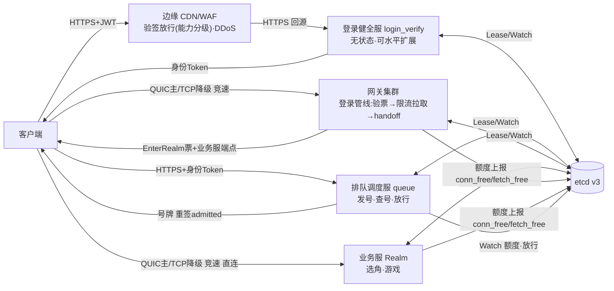
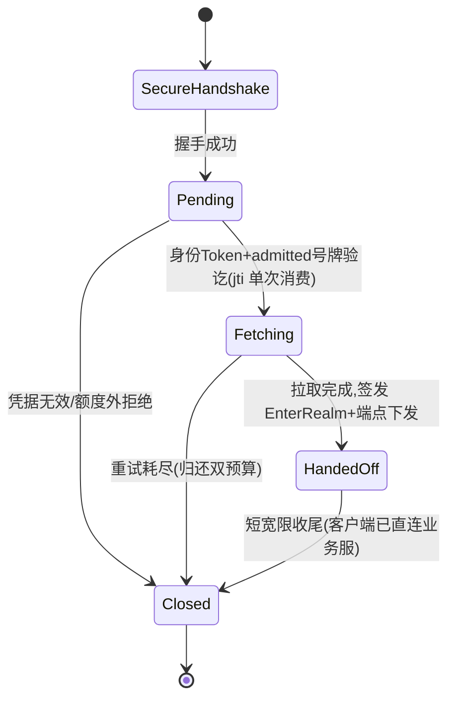

# 登录链路百万洪峰改造——架构规格

- 日期：2026-09-12
- 来源：[地图：百万洪峰登录链路定型](https://github.com/lvivvde/RealmMesh/issues/23)（11 张决策票全部定案后的汇总）
- 状态：评审稿（评审通过后本节状态改"定稿"）
- 术语：见 [CONTEXT.md](../../CONTEXT.md)（Network / Cluster / Gateway / Access / Messaging 各节）

## 1. 目标与范围

**目标场景＝瞬时登录洪峰**：100 万客户端短时间内（≤10 分钟）同时发起登录，系统有序放行、不雪崩、不丢位次。**稳态百万在线不在本规格范围**（但洪峰 10 分钟末约 100 万长连接落点的容量归属在 §6 覆盖）。

**范围外**：CDN/WAF 供应商选型与 DDoS 策略（只定契约）、存储层真 DB/Redis 接入（留 TODO）、深度风控/设备指纹、客户端 UI 实现、计费与注册。

**约束**：干净切换（无存量旧客户端）；ADR-0003 精简树（实现时才建目录/登记 ServiceType）；边缘（CDN/WAF/DDoS）只定契约、不在本仓库实现。

## 2. 拓扑总览

时序：verify → 取号 → 轮询 progress → admitted（号牌重签）→ 连网关 → fetching（限流拉取）→ handoff（EnterRealm + 端点下发，网关会话终结）→ 直连 Realm（兑换 EnterRealm → 选角/业务）。**网关只承载登录管线，不中转业务流量**（ADR-0005）。

## 3. 服务职责

| 服务 | 职责 | 关键属性 |
|---|---|---|
| 登录健全服 `login_verify` | 只回答"账号是否有效"（有效/封禁/白名单），签发身份 Token；暴露 JWKS | 无状态、可水平扩展、JWT/EdDSA（ADR-0004） |
| 排队调度服 `queue` | 发号、查号、按额度分批放行 | 唯一状态＝已放行号+放行速率两个原子量；v1 单实例+etcd 快照冷备（ADR-0006） |
| 网关集群 `gateway` | 登录管线：验票（身份 Token+号牌）→ 限流拉取账号数据 → handoff | 三阶段 Edge Session；分片共享无关；瞬时承载、稳态零负载 |
| 业务服 `realm` | 选角与游戏业务；EnterRealm 兑换点 | 直连长连接的家；conn_free 额度上报 |
| `AccountStore` | 账号有效性数据源抽象 | v1＝Lua 配置装载内存表（含封禁/白名单样例）；TODO：DB 真源、Redis 起服预热 |

## 4. 凭据体系

| 凭据 | 格式 | 签发方 | 消费方 | TTL | 单次消费 |
|---|---|---|---|---|---|
| 身份 Token | JWT/EdDSA（`iss=realmmesh/login-verify`） | 健全服 | 边缘验签（能力分级）、排队服、网关 | 30 min | `jti` 仅在网关入口单次消费 |
| 排队号牌 | JWT/EdDSA（`iss=realmmesh/queue`，号值+`admitted`） | 排队服 | 客户端轮询、网关验 `admitted=true` | 放行 + 5 min 宽限 | 否（位次查询复用） |
| EnterRealm 票据 | SessionTicket（对称键，原 EnterGame 用途更名） | 网关 | Realm 兑换 | 60 s | 是（`TicketReplayGuard`） |
| 旧 SessionTicket Login 用途 | — | — | — | — | **退役**（随旧 Login 服） |

- claims 最小集：header `alg/typ/kid` + payload `iss/sub/iat/exp/jti` + `aud=realmmesh-access`（RFC 8725 §3.9 要求消费方必须校验）+ `purpose=access`（私有 claim，防 token 类型混用）；`sub` 为 account_id 十进制字符串（uint64 超 2^53 会被边缘 JS 消费方的 JSON number 失真）；封禁/白名单状态不入 token（签发时检查 + 网关拉取时二次校验兜底）。
- 密钥：Ed25519 私钥只在健全服（`REALMMESH_IDENTITY_KEY_SEED`，env 注入）；公钥经 `GET /.well-known/jwks.json` 发布；内部消费方配置静态载入。轮换：`kid` 单调递增、24h 重叠窗双键并存。SessionTicket 对称键保留（内网签发+内网兑换）。
- 实现路线：libsodium 自研 Compact JWS + 极小 JSON，零新依赖（否 libjwt/jwt-cpp/HS256，理由见[调研](../research/2026-09-12-identity-token.md)）。
- **边缘契约＝能力分级**（ADR-0004）：免代码产品面（Cloudflare API Shield、Akamai API Gateway、Fastly VCL）均无 EdDSA——该类拓扑边缘仅 TLS 终结 + L3-L7 防护，回源 HTTPS、健全服本地验签兜底；EdDSA 边缘验签只在可编程计算面可行（Cloudflare Workers 原生、Fastly Compute 代码实现），「边缘验签 → 回源明文」选项仅限此类拓扑；Akamai 当前不可落地。各消费方本地验签一律不可省略，边缘验签只是把无效流量挡在边缘的优化。

## 5. 协议契约

### 5.1 HTTPS API（JSON over HTTP/1.1，keep-alive 必开；自研栈，ADR-0007）

| # | 端点 | 服务 | 请求 | 成功响应 |
|---|---|---|---|---|
| 1 | `POST /v1/login/verify` | 健全服 | `{account, credential}` | `200 {identity_token, account_id, expires_in}` |
| 2 | `POST /v1/queue/tickets` | 排队服 | Bearer 身份 Token | `202 {queue_number_token, number, estimated_wait_seconds}`；同 `sub` 幂等 |
| 3 | `GET /v1/queue/progress` | 排队服 | — | `200 {released_number, admit_rate, server_time}`；CDN 缓存 1~2s；位次/ETA 客户端本地算 |
| 4 | `GET /v1/queue/tickets/me` | 排队服 | Bearer 号牌 | `200 {status, position, estimated_wait_seconds, admit_grant?}`；首查与兜底 |
| 5 | `GET /.well-known/jwks.json` | 健全服 | — | JWKS |
| 6 | `/healthz`、`/metrics` | 两服务 | — | 健康 / Prometheus |

错误模型：`{code, message, retry_after_seconds?}`；HTTP `401`/`403`/`429`（必带 retry_after）/`202`/`200`。code 分段沿用 edge.proto 的段号约定：`1xxx` 凭据段（`1001` 凭据无效、`1002` 封禁、`1003` 白名单外）、`2xxx` 排队段（`2001` 号牌无效/过期）；排队中非错误态用 `200+status=queued`。**这套 code 与 `Envelope.message_id` 是两个独立编号空间**，数值相同不代表同一含义（`edge.proto` 的 `1001`/`1002` 是已退役的消息编号）。网关边另有一套 `EdgeError.code`：`1001` 身份凭据无效、`1004` 满额拒绝 attach、`2001` 号牌无效、`2002` 未认证、`3002` 入场票据无效。**边缘 block 行为不保证我方错误体**（如 Cloudflare 默认 403 HTML）。封禁/白名单 v1 显式细分，上线前评估切模糊拒绝（配置开关，TODO）。

### 5.2 etcd 额度结构

- key：`/realmmesh/budgets/service/<gateway|realm>/<instance_id>/budget`，值 `{conn_free, fetch_free?, updated_at}`（`fetch_free` 只在有拉取管线的 `gateway` 上出现，realm 仅 conn_free）；key 挂实例注册同一租约（实例死→额度消失）。
- 写：阈值触发（±10% 或 ≥1s 间隔）；读：排队服 Watch 前缀。
- 放行阀门：`min(Σ网关 fetch_free/conn_free, Σ业务服 conn_free, 配置步长)` 定时放批（≥2s 一批）。

### 5.3 网关状态机（Edge Session）

- 拉取：每实例全局预算池、可注入延迟桩（TODO 真 DB）；指数退避 ≤3 次 × 2s；失败断开并**归还连接额度与拉取预算**。
- 分片：进程内共享无关多分片（每分片全套 runtime），EdgeSessionId 哈希钉住；`shard_count` 配置化（默认＝核/2，8~16 片撑 10 万连接）。
- IO 分片与每连接资源模型见[调研](../research/2026-09-12-https-stack.md)与票 #28 定案；额度语义见票 #27。

## 6. 容量模型

**输入假设**（均标注"实现时核实"）：机器 64 GB / 32 核 / fd 1048576；每连接 TLS/TCP ≈ 8 KB、QUIC ≈ 20~30 KB；洪峰 100 万、10 分钟放完（≈1700/s）；轮询 ≥2s 自适应分档。

| 层 | 推演 | 结论 |
|---|---|---|
| 网关管线 | 10 万并发登录管线连接 ≈ 2~3 GB + 队列/表开销；管线驻留时长 ≈ 拉取耗时(秒级) | 单实例 10 万可行；洪峰需 ~10~17 实例分批消化 |
| 排队服 | 取号 ≈1700/s；位次查询被 progress CDN 缓存卸载（源站 ≤5千 QPS）；状态=两个原子量 | 单实例+冷备可行 |
| 健全服 | verify ≈3400/s（百万/5 分钟内进入排队）；无状态水平扩展 | 2~3 实例富余 |
| 业务服落点 | 洪峰 10 分钟末 ~100 万长连接在业务服侧；conn_free 双源并入放行阀门 | 业务服集群容量是放行速率的真实上限；实例数随容量模型扩展 |
| CDN 卸载 | progress 全局单调可缓存，命中率 ≥99% | 轮询流量 O(1) 于源站 |

## 7. 客户端契约

- **状态机（七态）**：`verifying → queued → admitted → gateway_connecting → handoff_received → realm_connecting → in_game`；回退：verify 失败→idle；号牌过期→自动重取；网关连接失败→admitted 号牌重入（宽限内）；Realm 直连失败→EnterRealm 重试（60s 内）。
- **轮询分档**：初始 2s；`position>1000`→5s、`≤100`→2s、`≤10`→1s；±20% 抖动；连续 3 次失败→指数退避至 30s；progress 带 `Cache-Control`；ETA 本地插值。
- **竞速**：0ms QUIC + 350ms TLS/TCP staged race 原样适用于两条连接（连网关、直连业务服），各自独立。
- **凭据**：纯内存持有、只走 HTTPS Bearer；进程重启＝重新登录排队。

## 8. 可观测与告警

指标清单（五服务）、六条告警 v1 初值（放行停滞 / 额度收敛 >10s / fetching 堆积 >90% 管线预算 / 拉取失败率 >1% / verify 5xx >0.1% / progress 源站 >5万 QPS）、Grafana 仪表盘归置——见票 #34 定案，落地在实施票 #47。

## 9. 压测验收

两级压测（L1 单服务定向进 CI + L2 全链路 `tools/loadgen`）与里程碑 M1 soak / M2 放行 / M3 轮询 / M4 故障注入 / M5 云端百万——门槛表见票 #32 定案，落地在实施票 #48。

## 10. 部署拓扑初稿（折叠自地图迷雾）

- 进程编排：全部服务沿用 `realm_mesh --service` 单入口（`login_verify`/`queue` 实现时新增 ServiceType）；健全服与网关按实例数水平扩，排队服单实例+冷备（同机或邻机）。
- etcd 布局：服务注册（现有）+ 额度前缀 `/realmmesh/budgets/service/<type>/<instance>/budget`（与实例同租约）；排队服快照 key 随放行批次更新。
- 多区：v1 单区；健全服无状态可多区前置 CDN；排队服冷备跨机不跨区（TODO：多区时号牌签发键与进度端点的区间一致性）。
- 边缘：CDN/WAF 契约＝Bearer + EdDSA 白名单 + JWKS URL + 边缘拒绝非保证性；按验签能力分级选型——可编程边缘（Workers/Compute 类）做边缘验签（可选明文回源），其余拓扑仅 TLS 终结 + 回源 HTTPS 验签（ADR-0004）。

## 11. 实施拆解索引

依赖边已用 GitHub 原生 dependency 接线；ctest 标签规划按 tests/README 约定。

| 票 | 内容 | 前置 |
|---|---|---|
| [#37](https://github.com/lvivvde/RealmMesh/issues/37) | 极小 JSON 编解码（unit） | — |
| [#38](https://github.com/lvivvde/RealmMesh/issues/38) | EdDSA JWT 编解码与 JWKS（unit） | #37 |
| [#39](https://github.com/lvivvde/RealmMesh/issues/39) | HTTP/1.1 有界解析与 HTTPS 传输 | — |
| [#40](https://github.com/lvivvde/RealmMesh/issues/40) | AccountStore 抽象与配置账号表 | — |
| [#41](https://github.com/lvivvde/RealmMesh/issues/41) | 登录健全服 | #38 #39 #40 |
| [#42](https://github.com/lvivvde/RealmMesh/issues/42) | 排队调度服 | #38 #39 |
| [#43](https://github.com/lvivvde/RealmMesh/issues/43) | 网关三阶段状态机与额度聚合 | #39 |
| [#44](https://github.com/lvivvde/RealmMesh/issues/44) | 限流拉取管线 | #43 |
| [#45](https://github.com/lvivvde/RealmMesh/issues/45) | handoff 与 EnterRealm 签发 | #44 |
| [#46](https://github.com/lvivvde/RealmMesh/issues/46) | Realm EnterRealm 兑换与直连入场 | #38 #45 |
| [#47](https://github.com/lvivvde/RealmMesh/issues/47) | 指标/告警/仪表盘 | #42 #43 |
| [#48](https://github.com/lvivvde/RealmMesh/issues/48) | L1 定向压测 + tools/loadgen | #41 #42 #43 |
| [#49](https://github.com/lvivvde/RealmMesh/issues/49) | 客户端状态机与自适应轮询 | #42 |
| [#50](https://github.com/lvivvde/RealmMesh/issues/50) | 退役旧 Login 链路 | #41 #45 #46 |

## 12. TODO 清单（显式留白，不进本规格实施范围）

1. Redis：账号缓存起服预热（健全服）；2. 真 DB：账号真源与网关拉取实现（替换延迟桩）；3. 模糊拒绝开关：封禁/白名单对外细分 → 统一拒绝（上线洪峰前评估）；4. 排队服分片：单实例 → 号段分片；5. 内部服务认证：网关↔Realm 桥接 mTLS vs 内网+etcd 校验；6. 多区一致性：号牌键与 progress 端点跨区；7. 客户端轮询参数压测校准（与告警初值一起在 M3/M5 校准）。

## 13. 决策索引

11 张决策票定案全文见[地图 #23](https://github.com/lvivvde/RealmMesh/issues/23) 的 Decisions so far；关键取舍固化为 ADR-0004（JWT/EdDSA 与边缘验签契约）、ADR-0005（网关=登录管线、业务直连）、ADR-0006（无状态号牌与全局进度端点）、ADR-0007（自研最小 HTTP/1.1 栈）。
